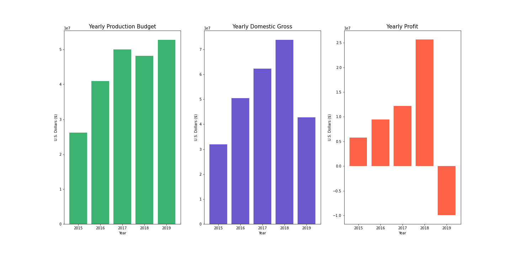
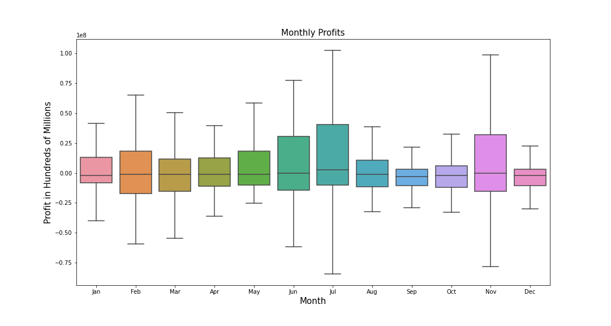
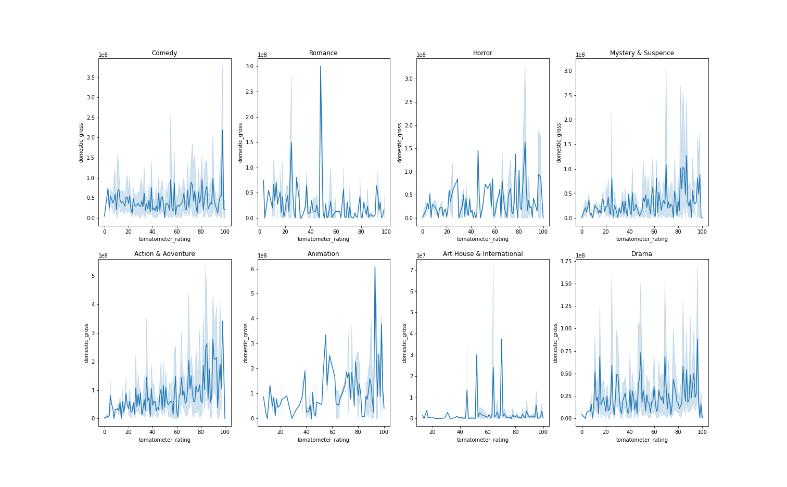
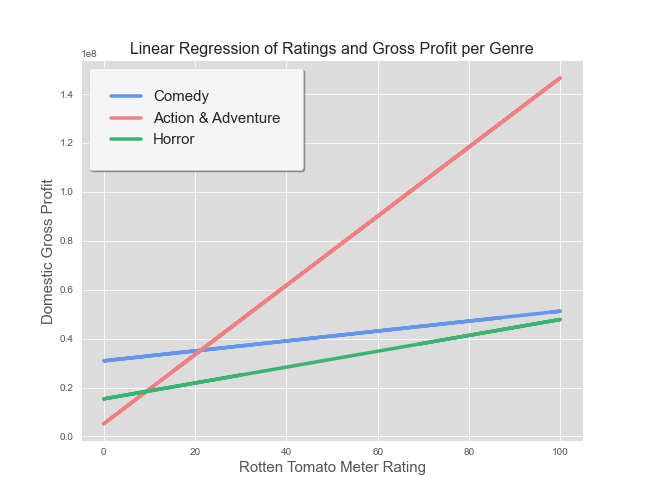
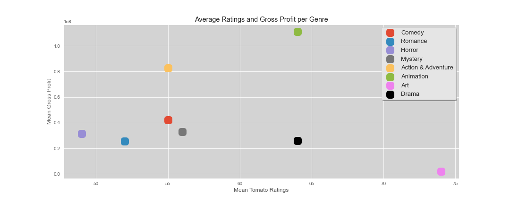

# Title

**Authors**: Wil Dotson, Ross Richesin, Katie Skoda

## Overview

We utilized our datasets to gather information on how much the production budget should be, which month is the best time to release, which genre is most viewed, and who the film should cater towards. 
Our data shows that you should release a PG-13 action/adventure film in July with a minimum production budget of $31 million and a target audience of ages 12 and up. 
We took a high level approach that focused mainly on the profitability and its effect on film success. By manipulating our domestic gross and production budget, we were able to create a new dataset--Profit--which provided us with better visualizations of which movies were most successful. We then used that data to observe which months grossed the most profit. With gross in mind, we found the top three genres that were most successful and compared their mean grosses with each month to ensure our original month observations matched. Once we had the genre and month, we found the most popular content rating to capture our target audience.

## Business Problem

There are millions of different directions you can take while deciding the production plan for your new movie. After analyzing multiple datasets, we can recommend the best direction to take your film. 
What makes a movie successful?
    Profitability
    High ratings
    Sufficient budget
    Proper accessibility rating
    Release timing
We chose to focus our efforts on overall profit because production companies main concentration is to generate the biggest payback possible.


## Data

Our datasets came from : 
Rotten Tomatoes
IMDb files
B.O.M. Film Productions Co.
Each data set includes different columns of information that we merged, compared, and manipulated to pull out all data needed to solve our questions.

We wanted to focus on the most recent years, but ran into some problems in 2019 and 2020. 

For obvious reasons, COVID halted film releases and production. 

2019 Problems:
Did not cater to audiences 
Unattractive sequels
Franchise fatigue
Too much competition + new streaming platforms
Bad reviews at the beginning (solution: release this movie on a different weekend than any other action & adventure films)


## Methods

Yearly Comparison of Production & Budget 
    Get a base for how much you will have to spend
Create Profit Data
Seasonal Profit
    Season would be the most profitable to release
Monthly  Profit
    Best month to release the movie
Average Ratings and Gross Profit per Genre
    Genre that produces profit and good ratings
Linear Regression of Ratings and Gross Profit per Genre
    Choose genre with high ratings and gross
Average Gross per Month by Genre
    Month to release movie with genre
Average Audience per Movie by Content Rating
    Choosing rating of the movie
Average Spent on Production by Genre
    Amount to spend on production


## Results


Genre: Action/Adventure
Release Date: July on a weekend where no other action/adventure films are being released
Rating: PG-13
Production Budget: $31 Million+


### Visual 1












## Conclusions

The genre we found to be the most profitable is Action & Adventure. Action & Adventure movies thrive during the month of July and September.  
We recommend to release the movie in the summer because it is the most profitable season for movies. July and November proved to be the most profitable months to release a movie. So with this knowledge, July would be the month that would produce the highest domestic gross.
You would want to spend a minimum of $31 million on production budget to heighten your profit and lessen your risk of failure. 
This is the average amount spent on Action & Adventure production budgets. With a production budget of this, we predict there to be a domestic gross of $41 million, which gives a profit of around $10 million. 


## For More Information

For any additional questions, please contact **name & email, name & email**

## Repository Structure

Describe the structure of your repository and its contents, for example:

```
├── README.md                           <- The top-level README for reviewers of this project
├── dsc-phase1-project-template.ipynb   <- Narrative documentation of analysis in Jupyter notebook
├── DS_Project_Presentation.pdf         <- PDF version of project presentation
├── data                                <- Both sourced externally and generated from code
└── images                              <- Both sourced externally and generated from code
```
